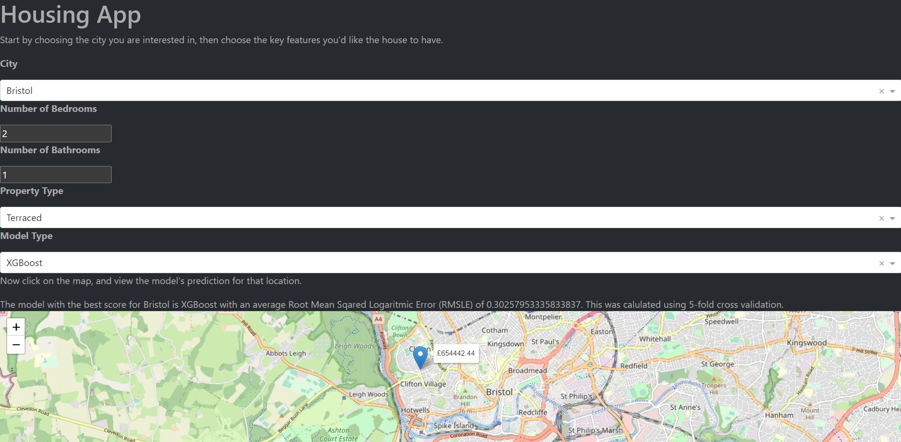

# Housing App

This is a Plotly Dash app built with Scikit-Learn which predicts house prices for several UK cities. Simply choose the city you are interested in from the dropdown menu, then select
the features you'd like to have. Finally, click on the map to see the model's prediction for that location.



### Run the app using Docker (recommended)
Check Docker is installed (https://docs.docker.com/engine/install/) and running.
```
docker pull ghcr.io/lawrence-d-lee/housing_app:latest
docker run -p 8050:8050 ghcr.io/lawrence-d-lee/housing_app:latest
```
### Run the app without Docker (Linux)
```bash
git clone https://github.com/lawrence-d-lee/housing-app.git
cd housing-app
python3 -m venv housing_venv
source housing_venv/bin/activate
pip install -r requirements.txt
python3 dash_housing_app.py
```
### Run the app without Docker (Windows)
```powershell
git clone https://github.com/lawrence-d-lee/housing-app.git
cd .\housing-app\
python -m venv housing_venv
housing_venv\Scripts\activate
pip install -r requirements.txt
python dash_housing_app.py
```
Then, either click on the location given on the terminal or visit http://localhost:8050/ to view the app.

The app comes with data about UK house prices which has already been obtained. To get current data, you can simply run the etl.py script.
